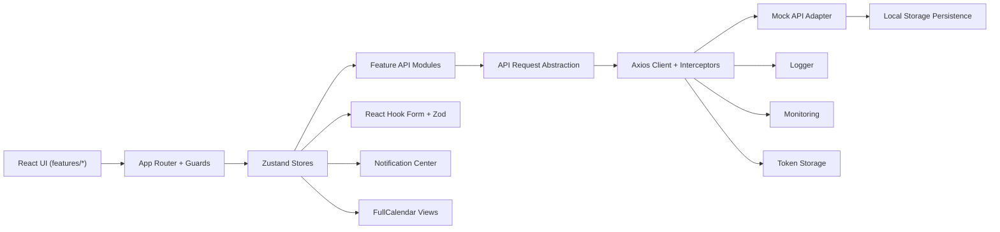

# Healthcare Appointment System

A production-grade React + TypeScript application for appointment discovery, booking, scheduling, reminders, and role-based healthcare workflows.

## Features

- Patient and doctor authentication with persisted token handling
- Protected routes and role-aware route access
- Doctor search by name with filters for specialization, rating, and date availability
- Paginated doctor directory with lazy-loaded route chunks
- Booking flow with React Hook Form + Zod validation
- Real-time style slot refresh through polling to reduce booking conflicts
- Monthly and weekly appointment calendar powered by FullCalendar
- Appointment cancellation and rescheduling with modal confirmations
- In-app notifications plus mock email/reminder notifications
- Global error handling, API logging, and lightweight monitoring hooks
- Loading skeletons, toast notifications, and accessibility-focused UI improvements
- Jest + React Testing Library coverage for critical flows

## Screenshots

The app is ready for screenshot capture from these routes:

- `/login` for authentication
- `/doctors` for discovery and filters
- `/doctors/doctor-1` for doctor profile
- `/appointments` for calendar and appointment management

Screenshot embedding was not completed in this environment because the local screenshot capture step required a headless-browser permission that was not granted. To add them locally, run:

```bash
npm install
npm run build
npm run preview -- --host 127.0.0.1 --port 4174
```

Then capture the routes above and place the images in a folder such as `docs/screenshots/`.

## Architecture



## Tech Stack

- React 18
- TypeScript
- Vite
- TailwindCSS
- React Router
- Axios
- Zustand
- FullCalendar
- React Hook Form
- Zod
- Jest
- React Testing Library

## Project Structure

```text
src/
  app/
    config/
    providers/
    routes/
    store/
  features/
    appointments/
    auth/
    calendar/
    dashboard/
    doctors/
    notifications/
  services/
    api/
    authToken.ts
    http.ts
    logger.ts
    mockApi.ts
    monitoring.ts
  shared/
    components/
    constants/
    hooks/
    types/
    utils/
```

## Production Quality Highlights

### Architecture

- Centralized API request abstraction in `src/services/api/`
- Runtime environment config in `src/app/config/env.ts`
- Error boundary and global monitoring bootstrap
- Dedicated logging and monitoring services

### Security

- Bearer token persistence with local token storage
- Protected routes with optional role restrictions
- Mock API authorization checks for appointments and notifications
- Role-aware booking behavior

### Performance

- Route-level code splitting with `React.lazy`
- Deferred search input for doctor filtering
- Memoized repeated card components
- Polling separated into reusable shared hook

### Accessibility

- Labeled form controls
- Accessible modals with `aria` metadata and `Escape` close support
- Notification center dialog semantics
- Toast region announced through `aria-live`

## Setup

### 1. Install dependencies

```bash
npm install
```

### 2. Configure environment variables

Copy `.env.example` to `.env` and adjust values if needed:

```env
VITE_APP_NAME=Healthcare Appointment System
VITE_API_BASE_URL=/api
VITE_ENABLE_API_LOGGING=true
VITE_ENABLE_MONITORING=true
VITE_APP_ENV=production
```

### 3. Start development server

```bash
npm run dev
```

### 4. Run production build

```bash
npm run build
```

### 5. Run tests

```bash
npm test
```

## Demo Credentials

- Patient: `patient@care.com` / `password123`
- Doctor: `doctor@care.com` / `password123`

## Testing

Critical flow coverage included:

- Protected route redirect and role gating
- Auth form validation behavior
- Double-booking prevention in the appointment API layer

Test files:

- `src/shared/components/routing/ProtectedRoute.test.tsx`
- `src/features/auth/components/AuthForm.test.tsx`
- `src/features/appointments/api/appointmentsApi.test.ts`

## Deployment

### Vercel

The project includes `vercel.json` with SPA rewrite handling:

- All routes rewrite to `index.html`
- Suitable for client-side React Router navigation

Deployment steps:

1. Import the repository into Vercel.
2. Keep the default build command as `npm run build`.
3. Keep the output directory as `dist`.
4. Set the `VITE_*` environment variables in the Vercel dashboard.

## Logging and Monitoring

- API request and response logs are handled in `src/services/api/client.ts`
- Captured application errors are funneled through `src/services/monitoring.ts`
- Global browser error and unhandled rejection listeners are registered during app bootstrap

## Available Scripts

- `npm run dev` starts the Vite dev server
- `npm run build` creates the production build
- `npm run preview` serves the production build locally
- `npm test` runs the Jest suite
- `npm run test:watch` runs tests in watch mode

## Notes

- The current backend is a secure mock adapter with local persistence, which keeps the frontend architecture ready for a real API.
- Notification email behavior is mocked and represented as notification records and logs.
- Polling is used for near-real-time slot freshness and can be swapped for WebSockets later without changing the feature boundaries much.
